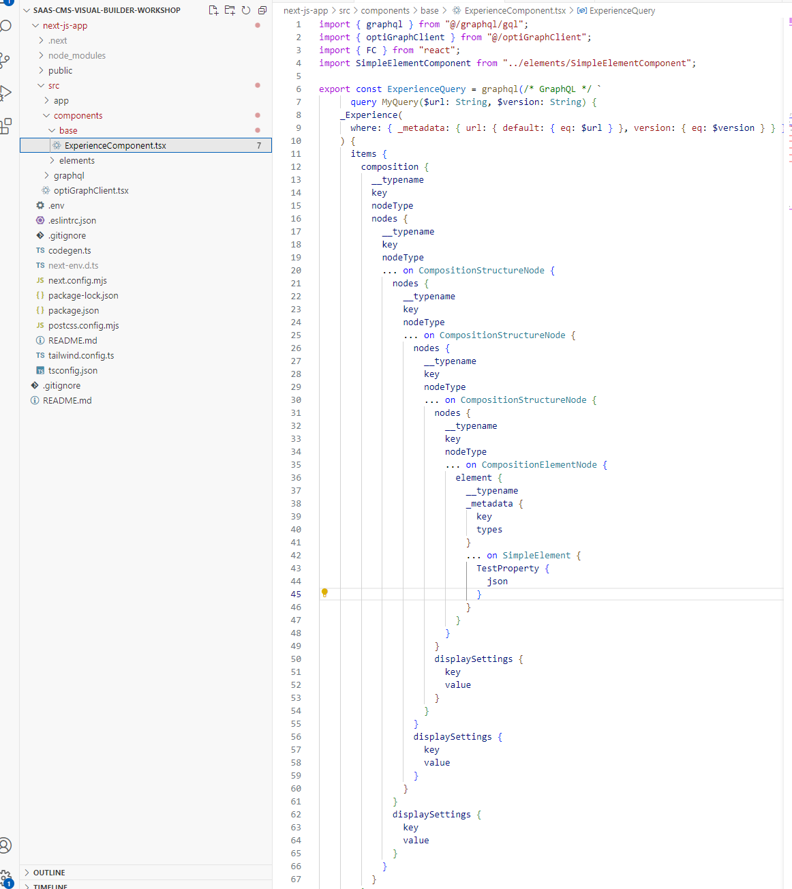

# 9. Create Experience components in NextJs app
We will now create React components in the application, which will render experiences

You can use the branch the branch "step-2-graphql-codegen" as a starting point for this part, if you haven't completed part 8.

The branch "step-3-create-experience-component" contains the solution for this part (9).

## 9.1. Create "components" folder
Create a new folder under "src" called "components"

## 9.2. Create "base" folder
Create a folder under "components" called "base"

## 9.3. Create "ExperienceComponent.tsx"
Create a new file under "base" folder called "ExperienceComponent.tsx"

## 9.4. Add skeleton for ExperienceComponent.tsx
Add the following in ExperienceComponent.tsx:

      import { graphql } from "@/graphql/gql";
      import { optiGraphClient } from "@/optiGraphClient";
      import { FC } from "react";
      
      export const ExperienceQuery = graphql(/* GraphQL */ `
          
      `)
      
      interface props {
          url: string | null
          version: string | null
      }
       
      const ExperienceComponent: FC<props> = async ({ url, version }) => {
        const data = await optiGraphClient.request(ExperienceQuery, {
          url,
          version,
        });
          return (
              <></>
          )
      }
       
      export default ExperienceComponent

This implementation is far from done. But lets go through what we have so far

### 9.4.1 ExperienceQuery
Take the query that you created earlier (section "Create GraphQL query for the experience" and paste it into the ExperienceQuery. The ExperienceQuery should look like this

      export const ExperienceQuery = graphql(/* GraphQL */ `
        query MyQuery($url: String, $version: String) {
            _Experience(
            where: { _metadata: { url: { default: { eq: $url } }, version: { eq: $version } } }
            ) {
            items {
                composition {
                    __typename
                    key
                    nodeType
                    nodes {
                        __typename
                        key
                        nodeType
                        ... on CompositionStructureNode {
                            nodes {
                                __typename
                                key
                                nodeType
                                ... on CompositionStructureNode {
                                    nodes {
                                        __typename
                                        key
                                        nodeType
                                        ... on CompositionStructureNode {
                                            nodes {
                                                __typename
                                                key
                                                nodeType
                                                ... on CompositionElementNode {
                                                    element {
                                                        __typename
                                                        _metadata {
                                                        key
                                                        types
                                                    }
                                                    ... on SimpleElement {
                                                        TestProperty {
                                                            json
                                                        }
                                                    }
                                                }
                                            }
                                        }
                                        displaySettings {
                                            key
                                            value
                                        }
                                    }
                                }
                                displaySettings {
                                    key
                                    value
                                }
                            }
                        }
                        displaySettings {
                            key
                            value
                        }
                    }
                }
                }
            }
            }
        }
      `)

### 9.4.2 Verify query
Verify that ExperienceQuery is working

Save the ExperienceComponent.tsx after the change, and wait a couple of seconds. GraphQL codegen is validating the query and updates the auto-generated types after verification.

It should be possible to build the project now. Verify that by runnin "npm run build" in a terminal

      npm run build

### 9.4.3 Add sections, rows, and columns
Update ExperienceComponent to loop through sections, rows, and columns

We can now use the data from Graph in our component. Lets hover over "data" constant, to see what we get from Graph

The output is "MyQueryQuery", which can be confusing. This type has been auto-generated based on the query name. Lets first update the query-name in ExperienceQuery to "Experience", and save the file.

The generated type looks much better now

Replace the html (<></>) with the following:

        

            {
            data?._Experience?.items?.map((experience) => {
              return (
                  

                      {
                      experience?.composition?.nodes?.map((grid) => {
                          if(grid?.__typename === "CompositionStructureNode") {
                              return (
                                  

                                      {
                                      grid.nodes?.map((row) => {
                                          if(row?.__typename === "CompositionStructureNode") {
                                              return (
                                                  

                                                      {
                                                      row.nodes?.map((column) => {
                                                          if(column?.__typename === "CompositionStructureNode") {
                                                              return (
                                                                  

                                                                      {
                                                                      column.nodes?.map((node) => {
                                                                          if(node?.__typename === "CompositionElementNode") {
                                                                            switch(node?.__typename)
                                                                            {
                                                                                default:
                                                                                    return <>Not implemented exception (for {node?.__typename})</>
                                                                            }
                                                                          }
                                                                      })
                                                                      }
                                                                  

                                                              )
                                                          }
                                                      })
                                                      }
                                                  

                                              )
                                          }
                                      })
                                      }
                                  

                              )
                          }
                          })
                      }
                  

              )
            })
            }
        

### 9.4.4 Use ExperienceComponent
Replace the default NexJs HTML with the ExperienceComponent

Open page.tsx under src/app and replace all HTML with the following:

    <main className="flex min-h-screen flex-col items-center justify-between p-24">
      <ExperienceComponent url={null} version={null} />
    </main>

Save the file

### 9.4.5 Test application
Try the application in a browser

The implementation is not done yet, because we are only looping through all sections, rows, and columns, to finally write a "Not implemented exception" for each element.

But lets see if we can get the "Not Implemented exception" in the website before moving on.

Write "npm run dev" in a terminal
      npm run dev

Browse to [http://localhost:3000](http://localhost:3000)

You should now see a "Not implemented exception" message, because that is what we have as output when finding an element. We will fix this in the next section.